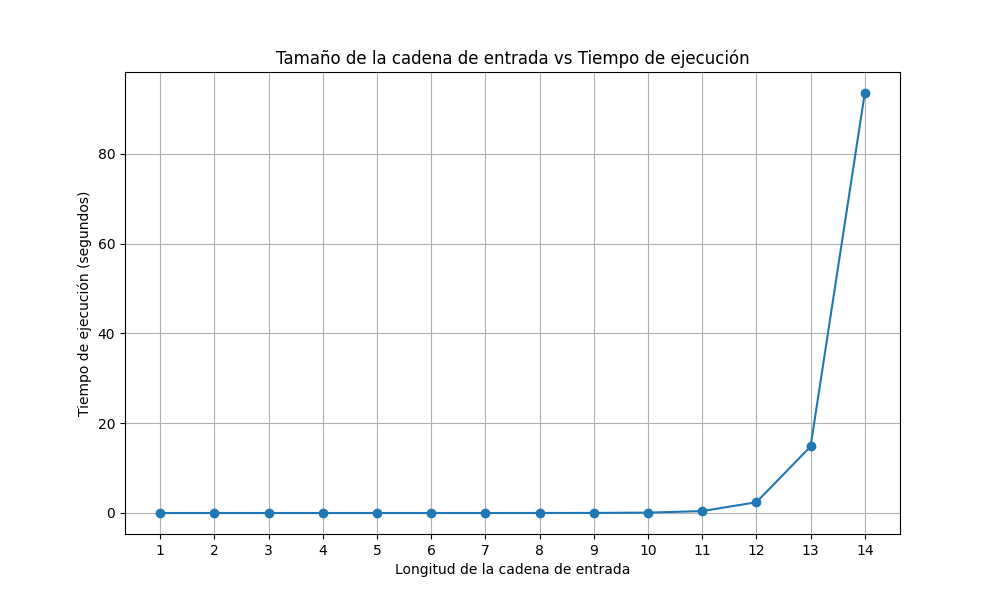

## Proyecto 1 - Notación O en el tiempo de ejecución de un algoritmo (Sucesión de Fibonacci)

Universidad del Valle de Guatemala   
Facultad de Ingeniería      
Análisis y diseños de algoritmos - Sección 30     

### Grupo 4 - Integrantes:      
- Adrian Fulladolsa Palma - 21592
- Karen Jimena Hernández Ortega - 21199
- Emilio José Solano Orozco - 21212
- Diego Alexander Hernández Silvestre - 21270
- Linda Ines Jimenez Vides - 21169
- Kristopher Javier Alvarado Lopez - 21188

### Descripción de las convenciones elegidas.

    1. Para la representación y manipulación de entradas en forma de máquinas de Turing se utilizó el proyecto 3, realizado en el curso de Teoría de Computación. Este proyecto consistió en la creación de un constructor que solicita y permite utilizar las propiedades fundamentales de una maquina tales como los estados, el alfabeto, el alfabeto de la cinta, el estado inicial, los estados de aceptación y las transiciones. De esta manera, solo se necesitó definir la estructura de la máquina de Fibonacci para poder simularla.

 
2. Se utilizó la siguiente máquina de Fibonacci la cual cuenta con:

    - Estados: q101, q102, q103, q104, q105, q106, q107, q108, q109, q201, q202,q203, q204, q301, q302, q303, q304, q305, q306, q307, q308, q309, q310, q311, q401, q402,q403, q404, q501, q502, q503, q601, q602, q603, q604, q701, q702, q703, q704, q801, q802,q803, q804, q805, q806, q807, q808, q809
    - 99 Transiciones
    - Los símbolos: "1","x", "*", en donde * fue reemplazado por "S"
    - Un estado inicial q0
    - Un estado final "qf" en donde "qf" fue reemplazado por qAccept
    - Un simbolo blank "b"
 [Referencia de la máquina de Fibonacci](https://www.researchgate.net/publication/1958918_Computing_Fibonacci_numbers_on_a_Turing_Machine)
### Diagrama de la máquina de Turing que calcula la sucesión de Fibonacci.

### Archivo con los componentes de la máquina de Turing del punto 2.
- El archivo se encuentra en "turing.json"
[Ir al archivo](https://github.com/Kojimena/P1-AA/blob/main/backend/turing.json)
### Programa en Python
 - Los componentes de la Máquina de Turing se deben configurar a través de un archivo
 [Ir al archivo](https://github.com/Kojimena/P1-AA/blob/main/backend/turing.json)
 - Debe permitir ingresar la cadena de entrada (según convención del punto 2).
    - Las cadenas pueden probarse en el siguiente enlace [Turing machine](https://resonant-gelato-08c783.netlify.app/)
 - Mostrar el listado de las configuraciones de la simulación, donde se indique el estado, la posición de la cabeza y los elementos de la cinta.
    - Al ingresar la cadena en [Turing machine](https://resonant-gelato-08c783.netlify.app/) y hacer click en "Run" se podrá observar la simulación de la misma en donde se indicará el estado posición de la cabeza y elementos de la cinta. Esta también puede ser probada en el archivo ``turing.py``. 
### Análisis empírico.

    La sucesión de Fibonacci consiste en una serie infinita compuesta de números enteros construida sobre la premisa de iniciar con los números 0 y 1, y sucesivamente, se van sumando los dos últimos números para generar el siguiente. A manera de representación, la sucesión se vería de la siguiente manera:

 

0 - 1 - 1 - 2 - 3 - 5 - 8 - 13 - 21 - 34 - 55 - ...

 

    Al determinar los tiempos de ejecución que genera este algoritmo de sucesión numérica, se generó un diagrama de dispersión y la regresión polinomial, con el que se identificó que el comportamiento de la sucesión es exponencial. Esto debido a que en la implementación realizada no se cuenta con memorización, ya que los resultados calculados no se almacenan en memoria para ser utilizados posteriormente. 
    
    Con respecto al árbol de recursión tendríamos:
       
        F(n)
       /    \
    F(n-1) F(n-2)

    A manera de ejemplificación el F(3) se representa de la siguiente manera:
       
        F(3)
       /    \
      F(2)  F(1)
     /   \
    F(1)  F(1)

Con el árbol, a través de inducción:
- Base: n = 1 
- Suponemos T(n-1) = O(2^(n-1)), por lo tanto
- T(n) = T(n-1) + T(n-2) + O(1) que es igual a
- T(n) = O(2^(n-1)) + O(2^(n-2)) + O(1) = O(2^n)

Por lo que la sucesión fibonacci es exponencial debido a que al calcularla de manera recursiva sin memoización esta crece exponencialmente con n.

 - Listado de entradas de prueba usadas para medir tiempos de ejecución de la máquina.
    - La lista puede ser consultada acá: [Lista de entradas](https://github.com/Kojimena/P1-AA/blob/main/tiemposDeEjecucion.json)
 - Diagrama de dispersión que muestre los tiempos de ejecución de la máquina en función de su tamaño de entrada.

 - Regresión polinomial o exponencial que se ajuste mejor a los datos.
